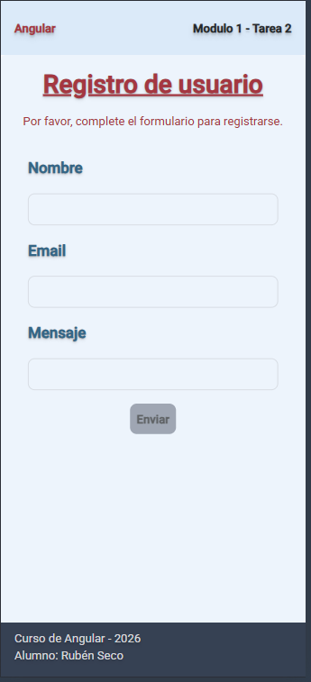
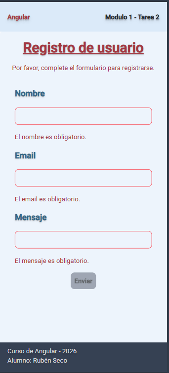
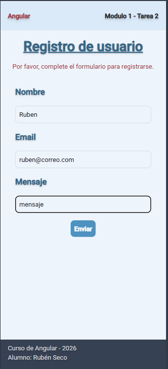
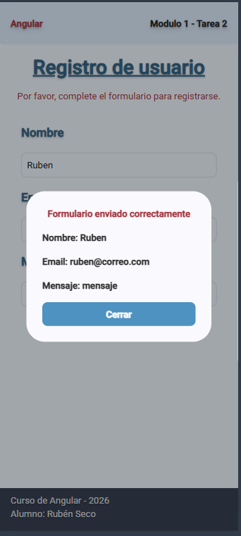

# Diplomatura en Profesional Full-Stack Developer

## Curso de desarrollo con Angular - Profesor: Gabriel Alberini

### Módulo 1: Angular

### Unidad 2: Angular básico. Directivas y Formularios.

### Consigna: Formulario interactivo.

Utiliza directivas estándar, directivas de atributos y el sistema de formularios reactivos en Angular,
aplicando validaciones y estilos dinámicos.

### Consideraciones:

- Se utiliza un componente de dialogo de Angular Material para mostrar el mensaje de éxito del formulario enviado
  y los datos cargados en el formulario. Angular Material permite personalizar el contenido de sus componentes.

- No se utilizan ***ngIf** y ***ngFor** porque la documentación de Angular los marca como obsoletos. En su lugar angular
  recomienda utilizar el **@if** y el **@for**.

- En el caso de esta tarea en lugar de utilizar el **@for** para renderizar los mensajes de validaciones, se utiliza un
  esquema de validación externo al formulario, manteniendo un código del formulario más limpio y separando las responsabilidades.
  El esquema enviará el mensaje de error correspondiente según como se esté complentando el formulario.

### Capturas de pantallas:

- Se pueden observar la siguientes pantallas:

  - Formulario vacío de inicio de la aplicación.
  - Mensajes de error en el formulario de acuerdo a las validaciones establecidas. Botón de enviar deshabilitado.
  - Formulario completado correctamente. Cambio de color del título y habilitación del botón de enviar.
  - Formulario enviado con éxito y dialogo mostrando los datos cargados en el formulario.

<table>
<tr>
<td></td>
<td></td>
<td></td>
<td></td>
</tr>
</table>

### Como ejecutar la tarea:

1. Clonar el repositorio:

```bash
git clone https://github.com/Diplomatura-Full-Stack-Developer/Angular-M1-T2

```

2. Instalar las dependencias:

```bash
npm install
```

3. Ejecutar la aplicación:

```bash
ng serve
```

### Recursos utilizados:

- Angular ([https://angular.dev/](https://angular.dev/))
- Angular CLI - Versión 22.1.7 ([https://angular.io/cli](https://angular.io/cli))
- Node.js - Versión 24.20.0 ([https://nodejs.org/es/download/](https://nodejs.org/es/download/))
- Tailwind CSS - Versión 4.1.12 ([https://tailwindcss.com/](https://tailwindcss.com/))
- Angular Material - Versión 22.1.5 ([https://material.angular.io/](https://material.angular.io/))

### Alumno: Rubén Seco

### Comisión: 181802
